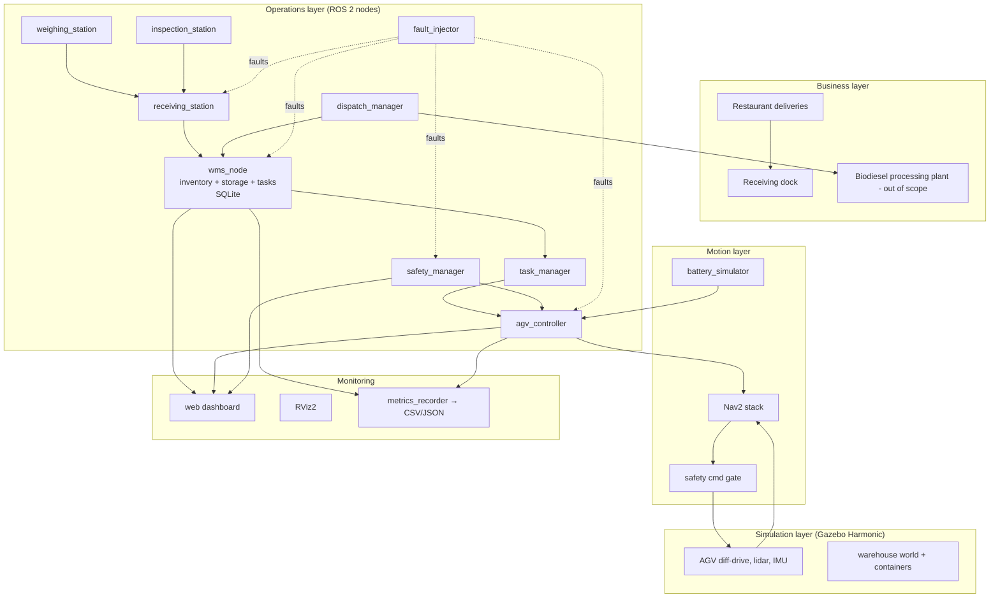
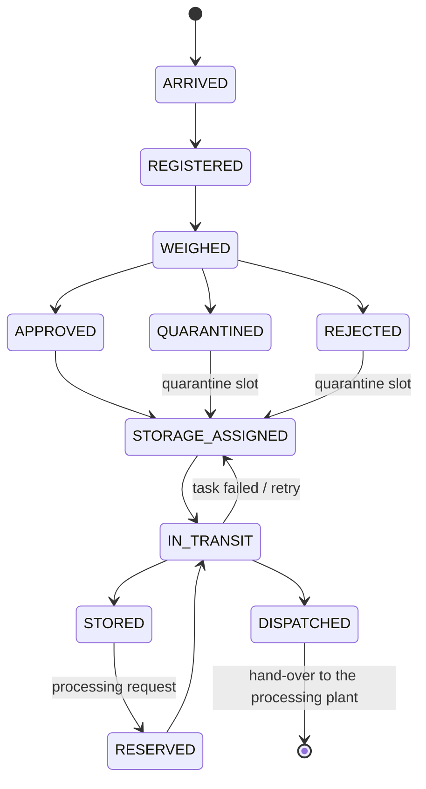
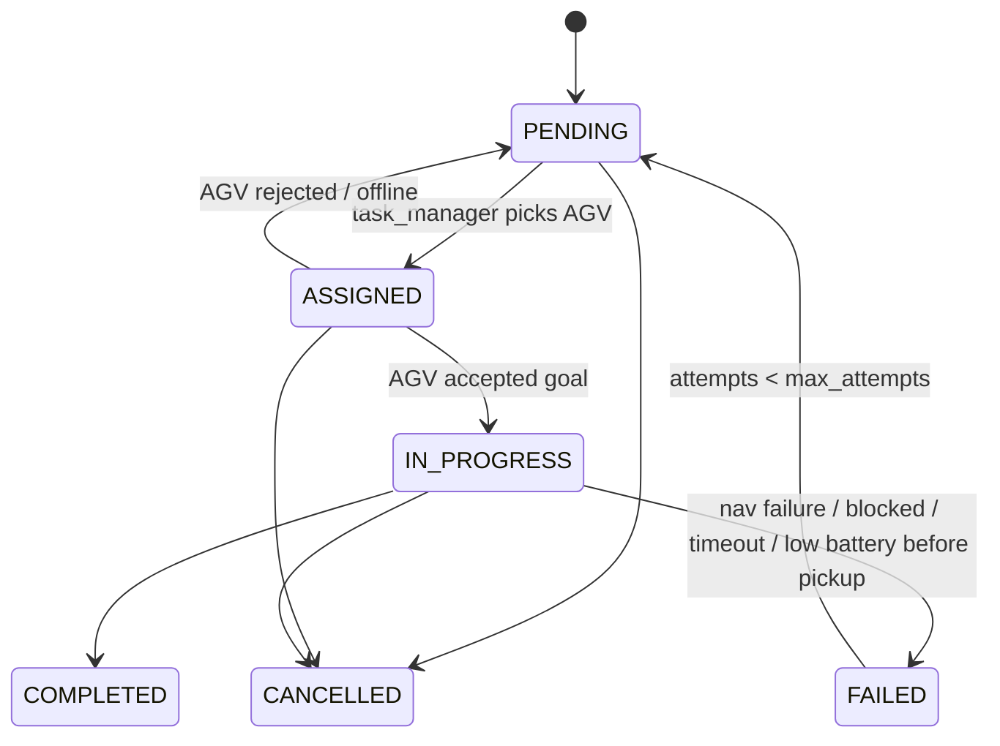
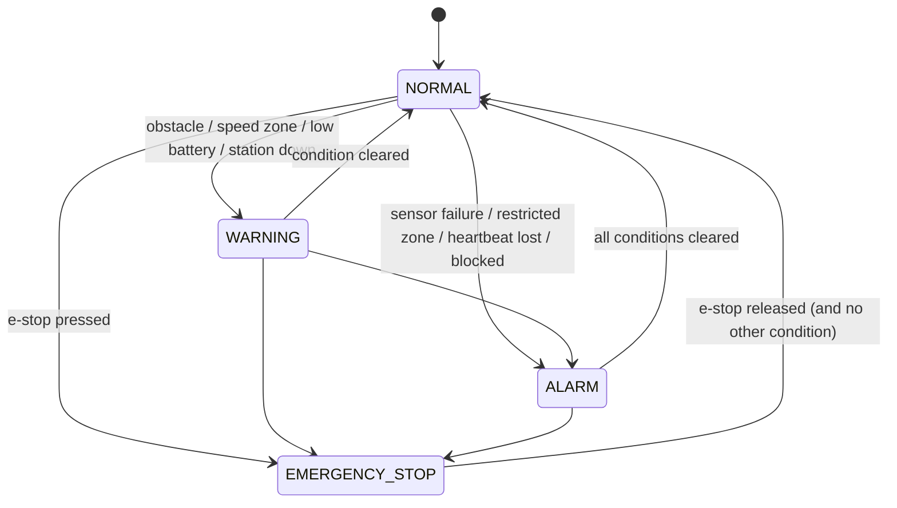
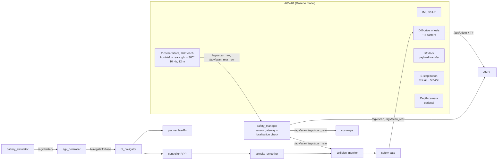

# System Architecture — UCO Warehouse Digital Twin

This is the top-level architecture. Detailed per-topic documents live in `docs/`
(`ros_architecture.md`, `simulation_architecture.md`, `warehouse_workflow.md`).

## 1. Technology stack

| Layer | Choice | Why |
|---|---|---|
| Middleware | ROS 2 **Jazzy** (LTS, May 2029) | Officially paired with Ubuntu 24.04 |
| Simulator | Gazebo **Harmonic** (gz-sim 8, LTS) | Official Gazebo for Jazzy; Gazebo Classic is EOL |
| ROS ↔ Gazebo | `ros_gz_bridge`, `ros_gz_sim` | Official bridge; also bridges the spawn / delete / set-pose services |
| Navigation | Nav2 (AMCL, NavFn, Regulated Pure Pursuit, collision monitor, velocity smoother, keepout filter) | Industry-standard, nothing custom |
| Robot model | URDF/Xacro + Gazebo system plugins (diff-drive, joint-state, IMU, GPU lidar) | Standard |
| Warehouse logic | Python 3 + SQLite (`sqlite3` std-lib) | Lightweight, no server, testable |
| Dashboard | Python std-lib HTTP server + Server-Sent Events + vanilla JS canvas | Zero extra dependencies |
| Analytics | CSV/JSON + matplotlib | Simple, reproducible |

## 2. Layered view



## 3. ROS 2 packages

The suggested package list (warehouse_manager, inventory_manager, storage_manager, …) was
consolidated so that each package has one clear responsibility and processes that must share
one database live together. Mapping:

| Package | Type | Responsibility | Covers suggested |
|---|---|---|---|
| `uco_interfaces` | ament_cmake | Custom msgs / srvs / actions for warehouse-domain data | simulation_interfaces* |
| `uco_common` | ament_python | Layout model (`warehouse_layout.yaml`), location lookup, shared constants and logging helpers | – |
| `uco_description` | ament_cmake | AGV URDF/Xacro + Gazebo sensor/drive plugins | – |
| `uco_simulation` | ament_cmake | World generator, generated world, ros_gz bridge config, Gazebo launch, `clock_throttle` (C++) | – |
| `uco_navigation` | ament_cmake | Nav2 params, generated map + keepout mask, RViz config, navigation launch | navigation_manager |
| `uco_wms` | ament_python | SQLite inventory, storage allocation, task records, `wms_node`, `metrics_recorder` | warehouse_manager, inventory_manager, storage_manager |
| `uco_stations` | ament_python | `receiving_station`, `weighing_station`, `inspection_station`, `dispatch_manager` | receiving_station, weighing_station, inspection_station, dispatch_manager |
| `uco_fleet` | ament_python | `task_manager`, `agv_controller`, `battery_simulator` | task_manager, agv_controller |
| `uco_safety` | ament_python | `safety_manager` (incl. cmd gate & sensor gateway), `fault_injector` | safety_manager, sensor_simulator (fault side) |
| `uco_dashboard` | ament_python | Web dashboard node | dashboard |
| `uco_bringup` | ament_python | Top-level launch files, scenario runner, scenario YAML | – |

\* A ROS package called `simulation_interfaces` already exists upstream (ROS simulation
standard interfaces), so reusing that name would shadow it; `uco_interfaces` is used instead.

## 4. Nodes

| Node | Package | Purpose |
|---|---|---|
| `wms_node` | uco_wms | Owns the SQLite database. Implements all WMS operations as services, publishes inventory, container events and task list. |
| `metrics_recorder` | uco_wms | Subscribes to tasks / AGV state / inventory; writes KPIs to CSV + JSON. |
| `receiving_station` | uco_stations | Simulates delivery arrival; spawns containers in Gazebo; runs unload → weigh → inspect → holding pipeline; registers and creates storage tasks. |
| `weighing_station` | uco_stations | Service: returns measured mass (with configurable sensor noise) and derived volume. |
| `inspection_station` | uco_stations | Service: simulated quality test (FFA %, water %, contamination) → approve / quarantine / reject. |
| `dispatch_manager` | uco_stations | Accepts processing requests, asks WMS for retrieval tasks, finalises containers delivered to the processing buffer. |
| `task_manager` | uco_fleet | Fleet dispatcher: matches pending tasks to available AGVs, sends `TransportContainer` goals, handles retries and task time-outs, AGV heartbeat. |
| `agv_controller` | uco_fleet | One per AGV. Action servers `TransportContainer` and `NavigateToLocation`; drives Nav2 `NavigateToPose`; performs pick/drop transfer; low-battery charging behaviour. |
| `battery_simulator` | uco_fleet | Battery state-of-charge model driven by odometry and charger contact; publishes `sensor_msgs/BatteryState`. |
| `safety_manager` | uco_safety | E-stop, zones (speed limit + restricted), sensor watchdog, heartbeat watchdog, obstacle / blocked detection, alarm aggregation; final velocity gate. |
| `fault_injector` | uco_safety | `InjectFault` service + CLI; publishes fault events consumed by the owning nodes; spawns physical obstacles for "blocked path". |
| `dashboard_server` | uco_dashboard | HTTP + SSE web UI. |
| Nav2 nodes | nav2_* | map_server, amcl, planner_server, controller_server, behavior_server, bt_navigator, velocity_smoother, collision_monitor, keepout filter servers, lifecycle managers. |
| Simulation | ros_gz | `gz sim`, `parameter_bridge`, `robot_state_publisher`. |

## 5. Communication architecture

### Topics
| Topic | Type | Publisher → Subscribers |
|---|---|---|
| `/warehouse/inventory` | `uco_interfaces/Inventory` | wms_node → dashboard, dispatch_manager, metrics |
| `/warehouse/container_state` | `uco_interfaces/ContainerState` | wms_node (on every change) → dashboard, metrics |
| `/warehouse/tasks` | `uco_interfaces/TaskList` | wms_node → task_manager, dashboard, metrics |
| `/warehouse/alerts` | `uco_interfaces/Alert` | all nodes → dashboard, metrics |
| `/warehouse/faults` | `uco_interfaces/Fault` | fault_injector → owning nodes |
| `/agv/state` | `uco_interfaces/AgvState` | agv_controller → task_manager, safety, dashboard, metrics |
| `/agv/battery` | `sensor_msgs/BatteryState` | battery_simulator |
| `/agv/odom` | `nav_msgs/Odometry` | Gazebo diff-drive (bridge) |
| `/agv/scan` | `sensor_msgs/LaserScan` | safety sensor gateway (from `/agv/scan_raw`, Gazebo) |
| `/agv/imu` | `sensor_msgs/Imu` | Gazebo IMU (bridge) |
| `/agv/ground_truth` | `nav_msgs/Odometry` | Gazebo pose publisher — used only for payload placement and metrics, never for navigation |
| `/agv/cmd_vel` | `geometry_msgs/Twist` | safety gate → Gazebo |
| `/safety/status` | `uco_interfaces/SafetyStatus` | safety_manager |
| `/speed_limit` | `nav2_msgs/SpeedLimit` | safety_manager → controller_server |
| `/tf`, `/tf_static`, `/map`, `/plan`, `/clock` | standard | standard |

### Velocity chain
```
controller_server ─cmd_vel_nav→ velocity_smoother ─cmd_vel_smoothed→ collision_monitor
   ─cmd_vel_safe→ safety_manager (e-stop / sensor-fault / restricted-zone gate) ─/agv/cmd_vel→ Gazebo
```

### Services
| Service | Type |
|---|---|
| `/warehouse/register_container` | `uco_interfaces/RegisterContainer` |
| `/warehouse/assign_storage` | `uco_interfaces/AssignStorage` |
| `/warehouse/create_task` | `uco_interfaces/CreateTask` |
| `/warehouse/cancel_task` | `uco_interfaces/CancelTask` |
| `/warehouse/assign_agv` | `uco_interfaces/AssignAgv` |
| `/warehouse/update_task` | `uco_interfaces/UpdateTask` (COMPLETE_TASK / FAIL / phase) |
| `/warehouse/update_status` | `uco_interfaces/UpdateStatus` |
| `/warehouse/update_location` | `uco_interfaces/UpdateLocation` |
| `/warehouse/request_dispatch` | `uco_interfaces/RequestDispatch` |
| `/stations/weigh`, `/stations/inspect` | `uco_interfaces/Weigh`, `Inspect` |
| `/stations/receive_delivery` | `uco_interfaces/ReceiveDelivery` |
| `/safety/emergency_stop` | `std_srvs/SetBool` |
| `/faults/inject` | `uco_interfaces/InjectFault` |
| `/world/uco_warehouse/{create,remove,set_pose}` | `ros_gz_interfaces/{SpawnEntity,DeleteEntity,SetEntityPose}` (bridged) |

### Actions
| Action | Server | Notes |
|---|---|---|
| `/agv_01/navigate_to_location` | agv_controller | `uco_interfaces/NavigateToLocation` — named location → Nav2 |
| `/agv_01/transport_container` | agv_controller | `uco_interfaces/TransportContainer` — pick + deliver; feedback reports phase (TO_PICKUP, PICKING, TO_DROPOFF, DROPPING) |
| `/navigate_to_pose` | Nav2 bt_navigator | `nav2_msgs/NavigateToPose` (standard) |

`PickContainer` and `DeliverContainer` are phases of `TransportContainer` instead of separate
actions: a pick without a following delivery has no meaning in this facility, and one action
keeps cancellation and preemption atomic.

## 6. Data model (SQLite, owned by `wms_node`)

```mermaid
erDiagram
  CONTAINER ||--o| STORAGE_SLOT : "occupies / reserves"
  CONTAINER ||--o{ TASK : "is moved by"
  CONTAINER ||--o{ EVENT : "history"
  CONTAINER { text id PK; text container_type; text material; real declared_volume_l; real measured_volume_l; real weight_kg; text status; text quality_status; text location; text destination; text assigned_agv; text supplier; real arrival_time; real updated_time }
  STORAGE_SLOT { text id PK; text zone; text kind; real x; real y; real yaw; text container_id; int reserved; int enabled }
  TASK { text id PK; text task_type; text container_id; text source; text destination; text status; text phase; text assigned_agv; int priority; int attempts; real created_time; real assigned_time; real started_time; real completed_time; text failure_reason }
  EVENT { int id PK; real stamp; text entity; text entity_id; text event; text detail }
```

### Container state machine


### Task state machine


### Safety state machine


## 7. Warehouse layout (36 m × 24 m pilot facility)

All coordinates in metres, world frame = map frame, origin at the south-west inner corner.
Source of truth: `ros2_ws/src/uco_common/config/warehouse_layout.yaml`.

```
 y=24 +--------------------------------------------------------------------------+
      | RECEIVING (restricted process strip y>19)       |            | MAINT. BAY  |
 dock |  [UNLOAD]===conveyor===[WEIGH]=====[INSPECT]     |            | (keep-out)  | dispatch
 door |                                                  |            |             | door
      |  HOLD-01  HOLD-02  HOLD-03  HOLD-04  HOLD-05     |            |  DSP-04     |
 y=16 |- - - - - - - - - - - - - - - - - - - - - - - - - - - - - - - - - - DSP-03   |
      |      CROSS AISLE (speed zone 0.3 m/s near receiving)                 DSP-02   |
 y=13 |                  ===== rack back / guard rail =====                   DSP-01   |
      | +--------+       A-01-R01 ... A-08-R01                         DISPATCH /     |
      | | OFFICE |            AISLE A                                   PROCESS BUFFER|
      | |(walled)|       A-01-R02 ... A-08-R02                                        |
      | +--------+       ===== back-to-back rack spine =====          +-------------+ |
      |                  B-01-R01 ... B-08-R01                         | TANK FARM   | |
      |                       AISLE B                                  | (bunded,    | |
      | [CHG-01]  Q-01 Q-02   B-01-R02 ... B-08-R02                    |  keep-out)  | |
 y=0  +--------------------------------------------------------------------------+
     x=0                   x=12                              x=25.4  x=29          x=36
```

- 32 storage positions (2 aisles × 2 rows × 8 bays), 5 holding positions, 2 quarantine
  positions, 4 dispatch-buffer positions, 1 charger.
- Every position has a *slot pose* (where the container stands) and an *access pose*
  (where the AGV stops, facing the slot).

## 8. AGV architecture (`AGV-01`)



- Mechanics: 1.0 m × 0.7 m chassis, 0.35 m deck height, two 0.1 m radius drive wheels
  at mid-length (sphere collisions for exact odometry), front and rear casters (rotates in place),
  ~150 kg, max 0.8 m/s.
- Sensors: two 264° lidars just outside diagonally opposite chassis corners (no self-hits, 360°
  together), IMU 50 Hz, wheel odometry 30 Hz, optional RGB-D camera; AMCL uses the front lidar.
- Payload transfer: a lift-deck transfer is *simulated* by moving the container entity
  between slot pose and deck pose with the bridged `set_pose` service; during travel the
  container rides on the deck under physics (friction).
- Battery: 48 V / 25 Ah model, consumption from motion + payload + idle loads.

## 9. Key design decisions

1. **One layout file → world, map, keepout mask, WMS slots, dashboard.** Prevents digital-twin drift.
2. **WMS core is ROS-free Python.** `wms_node` is a thin adapter; logic is unit tested directly.
3. **Nav2 for all navigation and collision avoidance**; custom code only for warehouse rules
   (zones, e-stop gate, heartbeat, blocked detection).
4. **Faults are events** on `/warehouse/faults`; each node handles only faults it owns,
   so the injector never reaches into another node's internals.
5. **Ground-truth pose is used only for payload placement and statistics**, never for navigation
   (navigation uses AMCL + odometry like a real robot).
6. **CPU budget** (the reference machine has 4 cores and no GPU): Gazebo's 500 Hz clock is
   throttled to 25 Hz for ROS (`clock_throttle`), every Python node uses rclpy's single-threaded
   executor (blocking work in worker threads or `async` callbacks), and state topics are
   published on change. Measured effect: real-time factor 0.1–0.3 → ≈ 1.0 (see development log).
