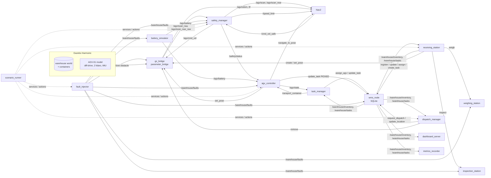

# ROS 2 Architecture

Target: ROS 2 Jazzy, Gazebo Harmonic. All application nodes use simulation time (`use_sim_time`).

## 1. Packages

| Package | Build type | Contents |
|---|---|---|
| `uco_interfaces` | ament_cmake | 9 messages, 13 services, 2 actions (below) |
| `uco_common` | ament_python | `layout.py` (facility model), `containers.py` (container SDF), `alerts.py`, `qos.py`, `config/warehouse_layout.yaml` |
| `uco_description` | ament_cmake | `urdf/agv.urdf.xacro` |
| `uco_simulation` | ament_cmake | `scripts/generate_world.py`, `scripts/snapshot.py`, `worlds/uco_warehouse.sdf` (generated), `config/bridge*.yaml`, `launch/sim.launch.py` |
| `uco_navigation` | ament_cmake | `config/nav2_params.yaml`, `maps/` (generated), `rviz/warehouse.rviz`, `launch/navigation.launch.py` |
| `uco_wms` | ament_python | `store.py` (SQLite WMS core), `wms_node`, `metrics_core.py`, `metrics_recorder` |
| `uco_stations` | ament_python | `station_models.py`, `receiving_station`, `weighing_station`, `inspection_station`, `dispatch_manager`, `sim_world.py` |
| `uco_fleet` | ament_python | `dispatch_core.py`, `battery_model.py`, `task_manager`, `agv_controller`, `battery_simulator`, `move_agv` CLI |
| `uco_safety` | ament_python | `safety_core.py`, `safety_manager`, `fault_injector`, `inject_fault` CLI |
| `uco_dashboard` | ament_python | `dashboard_server`, `static/` (HTML/JS/CSS) |
| `uco_bringup` | ament_python | `launch/warehouse.launch.py`, `scenario_runner`, `config/scenarios.yaml` |

Design rule: logic that can be tested without ROS lives in a `*_core.py` / `store.py` / `*_model.py`
module; the node file only adapts it to topics, services and actions.

## 2. Node graph



## 3. Nodes

| Node | Subscribes | Publishes | Services (server) | Actions (server) | Clients |
|---|---|---|---|---|---|
| `wms_node` | `/warehouse/faults` | `/warehouse/inventory`, `/warehouse/tasks`, `/warehouse/container_state`, `/warehouse/markers`, alerts | `/warehouse/{register_container, assign_storage, create_task, cancel_task, assign_agv, update_task, update_status, update_location, request_dispatch}` | – | – |
| `metrics_recorder` | tasks, inventory, `/agv/state`, `/agv/battery`, `/agv/battery/consumed_wh`, `/safety/status`, alerts | – (files) | – | – | – |
| `receiving_station` | `/warehouse/inventory` | alerts | `/stations/receive_delivery` | – | WMS services, `/stations/weigh`, `/stations/inspect`, world `create` / `set_pose` |
| `weighing_station` | faults | alerts | `/stations/weigh` | – | – |
| `inspection_station` | faults | alerts | `/stations/inspect` | – | – |
| `dispatch_manager` | `/warehouse/inventory` | alerts | `/stations/request_processing` | – | `/warehouse/request_dispatch`, `/warehouse/update_location`, world `remove` |
| `task_manager` | `/warehouse/tasks`, `/agv/state` | alerts | – | – | `/warehouse/assign_agv`, `/warehouse/update_task`, `/agv_01/transport_container` |
| `agv_controller` | `/agv/battery`, `/agv/odom`, `/agv/ground_truth`, `/safety/status`, faults, TF | `/agv/state`, alerts | – | `/agv_01/transport_container`, `/agv_01/navigate_to_location` | `/navigate_to_pose`, world `set_pose`, `/warehouse/update_task` |
| `battery_simulator` | `/agv/odom`, `/agv/ground_truth`, `/agv/state`, faults | `/agv/battery`, `/agv/battery/consumed_wh`, alerts | – | – | – |
| `safety_manager` | `/agv/scan_raw`, `/agv/scan_rear_raw`, `/agv/odom`, `/cmd_vel_safe`, `/agv/state`, `/agv/battery`, `/collision_monitor_state`, faults, TF | `/agv/scan`, `/agv/scan_rear`, `/agv/cmd_vel`, `/speed_limit`, `/safety/status`, alerts | `/safety/emergency_stop` | – | – |
| `fault_injector` | `/agv/ground_truth` | `/warehouse/faults`, alerts | `/faults/inject` | – | world `create` / `remove` |
| `dashboard_server` | inventory, tasks, `/agv/state`, `/safety/status`, `/agv/battery`, alerts | – (HTTP :8080) | – | – | delivery, processing, fault, e-stop services; `navigate_to_location` |
| `scenario_runner` | inventory, tasks, `/agv/state`, `/safety/status`, alerts | – (report) | – | – | delivery, processing, fault, e-stop; `navigate_to_location` |
| Nav2 | `/agv/scan`, `/agv/scan_rear`, `/agv/odom`, `/tf`, `/map`, `/keepout_filter_mask`, `/speed_limit` | `/plan`, `/cmd_vel_nav` → `/cmd_vel_smoothed` → `/cmd_vel_safe`, costmaps, `/collision_monitor_state` | lifecycle | `/navigate_to_pose` | – |
| `gz_bridge` | `/agv/cmd_vel` | `/clock`, `/agv/odom`, `/tf`, `/joint_states`, `/agv/ground_truth`, `/agv/scan_raw`, `/agv/scan_rear_raw`, `/agv/imu` | bridges `/world/uco_warehouse/{create, remove, set_pose}` | – | – |

## 4. Interfaces (`uco_interfaces`)

### Messages
| Message | Purpose | Key fields |
|---|---|---|
| `ContainerState` | one container record | id, container_type, material, supplier, declared/measured volume, weight_kg, status, quality_status, location, destination, assigned_agv, arrival_time |
| `StorageSlot` | one position | id, kind (STORAGE/HOLDING/QUARANTINE/DISPATCH), x, y, yaw, container_id, reserved, enabled |
| `Inventory` | full warehouse snapshot | containers[], slots[], capacity, occupied, occupancy, stored volume, received / dispatched totals |
| `Task`, `TaskList` | transport tasks | id, type, container, source, destination, status, phase, AGV, priority, attempts, timestamps, failure_reason |
| `AgvState` | AGV heartbeat + summary (2 Hz) | state, current task, carried container, pose, speed, battery, charging, available, distance, busy time |
| `Alert` | severity-tagged event | severity INFO/WARN/ERROR/ALARM, source, code, message |
| `SafetyStatus` | safety supervisor output | state, estop, motion_allowed, speed_limit, zone, active_conditions[] |
| `Fault` | injected fault event | fault_type, active, target, value, duration_s |

String constants (e.g. `ContainerState.STATUS_STORED`) define the allowed status values.

### Services
`RegisterContainer`, `AssignStorage`, `CreateTask`, `CancelTask`, `AssignAgv`, `UpdateTask`,
`UpdateStatus`, `UpdateLocation`, `RequestDispatch`, `InjectFault`, `Weigh`, `Inspect`,
`ReceiveDelivery`. Every response carries `success` + `message`; WMS rule violations are returned
as `success=false` with an operator-readable message, never as exceptions.

### Actions
| Action | Goal | Feedback | Result |
|---|---|---|---|
| `NavigateToLocation` | location_id (aliases accepted) | state, distance_remaining | success, message, travel_time_s |
| `TransportContainer` | task_id, container_id, source, destination | phase (TO_PICKUP, PICKING, TO_DROPOFF, DROPPING), distance_remaining | success, message, failure_code, duration_s, distance_m |

Standard interfaces are used wherever they fit: `sensor_msgs/LaserScan`, `Imu`, `BatteryState`,
`nav_msgs/Odometry`, `geometry_msgs/Twist`, `nav2_msgs/SpeedLimit`, `nav2_msgs/NavigateToPose`,
`std_srvs/SetBool` (e-stop), `visualization_msgs/MarkerArray`, `ros_gz_interfaces` world services.

## 5. QoS

| Profile | Used for | Settings |
|---|---|---|
| `LATCHED` | inventory, tasks, safety status, speed limit, RViz markers | reliable, transient local, depth 1 |
| `EVENTS` | alerts, container state events | reliable, volatile, depth 100 |
| `FAULTS` | `/warehouse/faults` | reliable, transient local, depth 50 |
| sensor data | lidar, odometry | best effort (RViz displays configured accordingly) |

## 6. Velocity and safety chain

```
controller_server / behavior_server ─cmd_vel_nav→ velocity_smoother ─cmd_vel_smoothed→ collision_monitor
   ─/cmd_vel_safe→ safety_manager gate (zero on e-stop, sensor fault, heartbeat loss, restricted-zone stop;
                   clamps |v| to the zone speed limit) ─/agv/cmd_vel→ Gazebo diff-drive
```

## 7. Frames

`map` (AMCL) → `odom` (diff-drive) → `base_footprint` → `base_link` → wheels, casters, `deck_link`,
`lidar_front_link`, `lidar_rear_link`, `imu_link`, `estop_link`, `beacon_link`, `camera_link`.
`world` (Gazebo) coincides with `map` because the map is generated from the world geometry.
