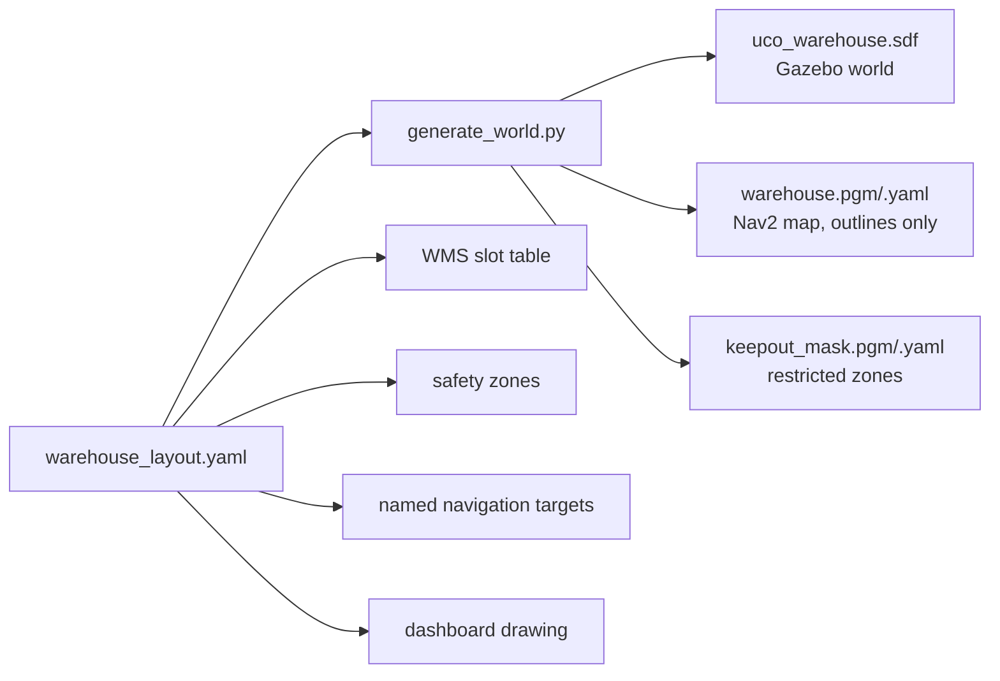

# Simulation Architecture

## 1. Single source of truth

`generate_world.py --check` (run by the `uco_simulation` tests) fails if any generated file is
stale, so the world, the map and the WMS can never disagree.

## 2. World (Gazebo Harmonic)

| Element | Implementation |
|---|---|
| Physics | DART (Gazebo default), 2 ms step, real-time factor target 1.0 |
| Systems | Physics, UserCommands (create / remove / set_pose services), SceneBroadcaster, Sensors (ogre2), IMU |
| Building | 36 × 24 m, 3.5 m walls, closed roller-shutter doors (dock, transfer door to the plant, personnel door) |
| Receiving | conveyor line with UNLOAD / WEIGH / INSPECT stations, inspection booth, barrier, 5 holding positions |
| Storage | 2 aisles × 2 rows × 8 bays = 32 floor positions, rack guard rail, back-to-back rack spine, end posts |
| Other | dispatch buffer (4), quarantine (3), charger with barriers, bunded tank farm (3 tanks), office, pallet store, columns |
| Markings | zone outlines, slot outlines, hatched keep-out areas, charger pad (visual only) |
| Lighting | one directional light and six ceiling point lights, shadows off (CPU rendering) |
| Outside | delivery truck at the dock door |

## 3. Containers

Generated from `container_types` in the layout (`uco_common/containers.py`):

| Type | Footprint | Height | Tare | Mass full |
|---|---|---|---|---|
| DRUM_200L | 0.8 × 0.8 m (pallet + drum) | 1.02 m | 33 kg | 33 + 0.92 kg/L × volume |
| IBC_1000L | 1.2 × 1.0 m (pallet + cage + tank + oil level) | 1.16 m | 62 kg | up to ≈ 980 kg |

Each container is a separate dynamic model named after its WMS id (`UCO-0001`), spawned by the
receiving station through `/world/uco_warehouse/create`.

**Transfers.** Movements between stations, slot and AGV deck are *simulated transfers*: the
container entity is placed at the target pose with `/world/uco_warehouse/set_pose` (conveyor
movement on the receiving line, lift-deck pick-up / set-down by the AGV). **While the AGV drives,
the container rides on the deck under physics** (friction only). A measured carry trace showed no
slip (offset 0.000 m in the AGV frame through turns).

## 4. AGV model

| Item | Value |
|---|---|
| Chassis | 1.0 × 0.7 × 0.24 m, 140 kg, deck top at 0.35 m |
| Drive | differential drive, wheel radius 0.10 m, track 0.60 m, sphere collisions (exact odometry), front/rear frictionless casters |
| Limits | 1.0 m/s, 1.2 rad/s in the plugin; 0.8 m/s in Nav2; zone limits 0.3–0.6 m/s |
| Lidars | 2 × gpu_lidar, 264° (±132°), 265 rays, 10 Hz, 0.08–12 m, σ = 1 cm; at the front-left and rear-right corners → 360° |
| IMU | 50 Hz, gaussian noise |
| Odometry | diff-drive plugin, 30 Hz, publishes `odom → base_footprint` |
| Ground truth | odometry-publisher plugin, 20 Hz, frame `world` (payload placement and metrics only) |
| Camera | optional RGB-D, 320 × 240 @ 5 Hz (`camera:=true`) |
| E-stop | modelled visual + `/safety/emergency_stop` service |

## 5. ROS ↔ Gazebo bridge

`uco_simulation/config/bridge.yaml` (ros_gz_bridge `parameter_bridge`): clock, cmd_vel, odom, TF,
joint states, ground truth, both raw scans, IMU, and the three world services. The optional
camera bridge is a separate file.

## 6. Performance (reference container: 4 CPU cores, no GPU, Mesa llvmpipe)

| Configuration | Real-time factor |
|---|---|
| World + AGV (2 lidars) | 0.97 |
| + RGB-D camera | 1.00 (camera at 5 Hz) |
| Full stack (Nav2, all nodes) | ≈ 0.85–0.9 (estimated from task log timing: 110 s simulated took 126 s) |

## 7. Headless operation

EGL headless rendering crashes ogre2 without a GPU device. `scripts/env.sh` therefore starts
`Xvfb :99` and sets `LIBGL_ALWAYS_SOFTWARE=1` when no display is available; all sensor rendering
then runs on llvmpipe.
