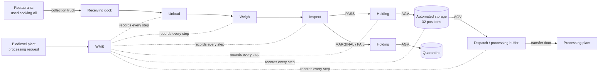
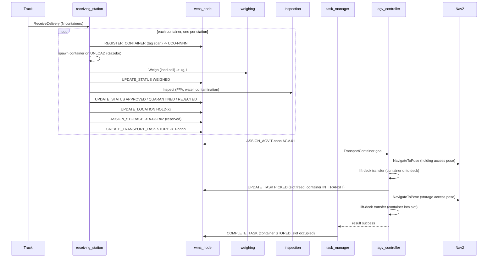

# Warehouse Workflow

## 1. Business-to-automation view



## 2. Inbound: delivery to storage



## 3. Outbound: processing request to dispatch

```mermaid
sequenceDiagram
  participant Plant as processing plant
  participant DM as dispatch_manager
  participant WMS as wms_node
  participant TM as task_manager
  participant AGV as agv_controller
  Plant->>DM: request_processing (count)
  DM->>WMS: REQUEST_DISPATCH
  WMS->>WMS: select STORED + PASS containers, oldest first; reserve DSP slot; RESERVED
  WMS-->>DM: containers, RETRIEVE tasks
  TM->>AGV: TransportContainer (storage -> DSP-0x)
  AGV-->>TM: success
  TM->>WMS: COMPLETE_TASK (DISPATCHED, storage slot freed)
  DM->>DM: dwell handover_delay_s at the buffer
  DM->>WMS: UPDATE_LOCATION PROCESSING_PLANT (hand-over)
  DM->>DM: remove container from Gazebo (transfer door)
```

## 4. Container lifecycle

| Status | Set by | Location |
|---|---|---|
| REGISTERED | receiving (tag scan) | UNLOAD |
| WEIGHED | receiving ← weighing_station | WEIGH |
| APPROVED / QUARANTINED / REJECTED | receiving ← inspection_station | INSPECT → HOLD-xx |
| STORAGE_ASSIGNED | WMS allocation | HOLD-xx (destination = slot) |
| IN_TRANSIT | AGV pick-up | AGV-01 |
| STORED | task completion | A-/B- slot or Q- slot |
| RESERVED | processing request | storage slot (destination = DSP-x) |
| DISPATCHED | retrieval completion | DSP-x, then PROCESSING_PLANT after hand-over |

Quality status (PASS / MARGINAL / FAIL) is kept separately from the logistic status, so a
quarantined container that has been moved is `STORED` with quality `MARGINAL` at `Q-0x`.

## 5. Task lifecycle and recovery

| Event | WMS effect |
|---|---|
| assignment | PENDING → ASSIGNED (AGV recorded on task and container) |
| goal accepted | ASSIGNED → IN_PROGRESS, phase TO_PICKUP |
| phase feedback | phase updated (PICKING, TO_DROPOFF, DROPPING) |
| pick-up done | `picked`, container IN_TRANSIT on the AGV, source slot freed |
| success | COMPLETED, container placed, slot occupied |
| failure before pick-up | attempt counted; PENDING again until `max_task_attempts` (3), then FAILED and reservation released |
| failure after pick-up | always PENDING for the same AGV (the container must be delivered); pick-up is skipped |
| low battery before pick-up | PENDING without counting an attempt; AGV charges |
| time-out (600 s) | task_manager cancels the goal; counted as a failure |
| cancel | only before pick-up; reservation released, container status restored |

## 6. Battery management

1. `battery_simulator` integrates power draw (idle 60 W + 220 W per m/s + 80 W per rad/s,
   ×1.35 when loaded) and charges at 2.4 kW only when the AGV is docked at CHG-01.
2. Below 25 % `agv_controller` aborts a task that has not picked up yet (requeued without
   penalty) or finishes a task that is carrying a container, then drives to the charger.
3. The AGV is unavailable until it reaches 80 %; the task manager also never assigns tasks to an
   AGV below 30 %.
4. When idle for 45 s the AGV returns to the charger (opportunity charging); this trip is
   pre-empted by new tasks.
