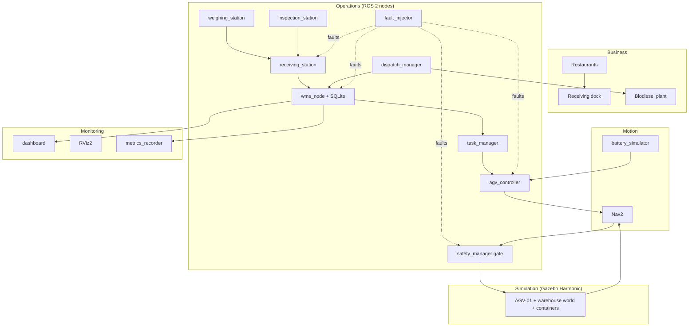
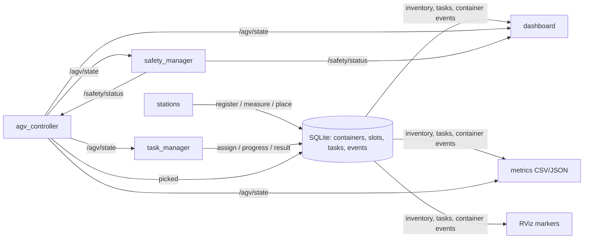
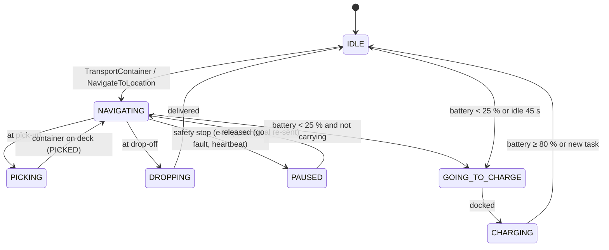
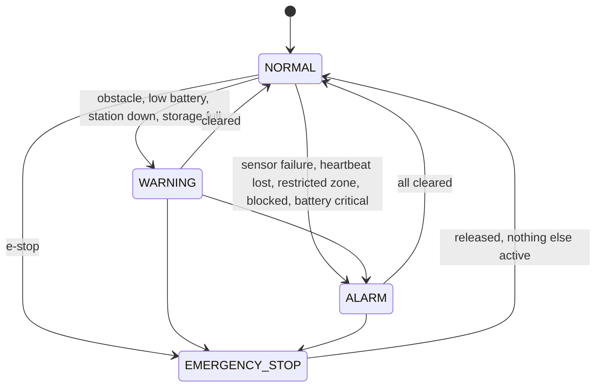

# Automated Warehouse Digital Twin for a Used-Cooking-Oil Biodiesel Plant

**Engineering project report — Phase 1: receiving, storage, transport and dispatch of used cooking oil**

| | |
|---|---|
| Platform | Ubuntu 24.04 · ROS 2 Jazzy · Gazebo Harmonic · Nav2 · Python 3.12 · SQLite |
| Repository | this repository (`ros2_ws/src/uco_*`, `docs/`, `scripts/`) |
| Status | implemented and verified in simulation (see Chapters 14–16 for measured results) |

---

## Contents
1. Introduction · 2. Business problem · 3. Problem definition · 4. Objectives · 5. System requirements ·
6. System architecture · 7. Warehouse design · 8. ROS 2 architecture · 9. Gazebo simulation ·
10. AGV design · 11. Warehouse management · 12. Safety · 13. Implementation · 14. Testing ·
15. Performance evaluation · 16. Results · 17. Limitations · 18. Future development · 19. Conclusion ·
Appendix A: how to reproduce

---

## 1. Introduction

Used cooking oil (UCO) collected from restaurants is a valuable feedstock for biodiesel. Before
any chemistry happens, a UCO plant has to *receive* hundreds of drums and IBC totes, establish
what is in each of them, store them safely and deliver them to processing in the right order.
This material-handling front end determines how much feedstock the plant can accept, how well
the oil quality is traced, and how many people have to work next to forklifts.

This project builds a **digital twin** of that front end: a physically simulated pilot warehouse in
Gazebo with an autonomous mobile robot (AGV/AMR) navigating with Nav2, a warehouse management
system (WMS) that tracks every container in SQLite, simulated receiving stations (unloading,
weighing, quality inspection), a dispatch interface to the processing plant, a safety supervisor,
a fault-injection framework, a web dashboard, and a metrics pipeline. The biodiesel process itself
is explicitly out of scope for this phase.

The work followed an engineering-phase approach (Phase 0 environment inspection to Phase 17
report). Every phase was built, run, tested and fixed before moving on; the development log
(`docs/development_log.md`) records each problem found and how it was resolved. Nothing in this
report is claimed as working unless it was executed; unverified items are stated as such.

## 2. Business problem

**The business concept.** A collection company visits restaurants, pumps or collects their used
frying oil in 200 L drums or 1000 L IBC totes, and brings it to a central facility. The oil is
pre-treated and converted into biodiesel (transesterification); by-products such as glycerol are
sold. Revenue depends on throughput and on oil quality: free fatty acids (FFA) and water content
drive pre-treatment cost and yield, and contaminated loads must not enter the process.

**Why automate the warehouse.**

- *Traceability*: every container must be attributable to a supplier, a weight and a quality result
  (payment of suppliers, sustainability certification, process control).
- *Quality segregation*: approved, marginal and rejected oil must never mix.
- *Safety*: heavy liquid containers (up to ≈ 1 t) and forklifts in a small building are the main
  accident risk; restricted zones (tank farm, process line) must be enforced.
- *Labour and hours*: deliveries arrive in bursts; an AGV can work continuously.
- *Planning*: the processing plant needs reliable, FIFO-ordered feedstock supply.

**Why a digital twin first.** The layout, the number of storage positions, the AGV fleet size and
the control logic can be evaluated and demonstrated to investors and authorities before any
equipment is bought, and the same software architecture (ROS 2) can later drive real hardware.

## 3. Problem definition

Design and simulate an automated warehouse that:

1. accepts deliveries of UCO containers and identifies, weighs and inspects each one;
2. allocates a storage position to every approved container (and a quarantine position to
   non-approved material) and moves it there with an AGV;
3. keeps an always-consistent inventory (container, quantity, quality, location, status, history);
4. retrieves containers on request and delivers them to a processing buffer, oldest first;
5. operates safely: emergency stop, obstacle handling, restricted zones, speed zones,
   sensor and communication watchdogs, battery management;
6. tolerates and reports faults, and continues operating when they clear;
7. is observable (Gazebo, RViz2, dashboard) and measurable (KPIs recorded per run).

## 4. Objectives

**Technical objectives**

| ID | Objective | Where verified |
|---|---|---|
| T1 | Runnable Gazebo Harmonic world of a 36 × 24 m pilot warehouse | Ch. 9, Fig. 2 |
| T2 | AGV with lidar, odometry, IMU, battery, e-stop; autonomous navigation with Nav2 | Ch. 10, 14 |
| T3 | WMS with SQLite persistence and the operations REGISTER … REQUEST_DISPATCH | Ch. 11, 14 |
| T4 | Automated task assignment and execution incl. retries and time-outs | Ch. 11, 14 |
| T5 | Simulated safety logic and nine injectable fault types | Ch. 12, 14 |
| T6 | Dashboard, RViz2 visualisation, metrics with graphs | Ch. 16 |
| T7 | One-command reproducible demonstration | Appendix A |

**Business objectives (demonstrated in simulation)**

| ID | Objective |
|---|---|
| B1 | Every received container is traceable from dock to processing plant |
| B2 | Non-approved oil is physically segregated (quarantine) automatically |
| B3 | Processing requests are served FIFO from approved stock |
| B4 | Faults do not lose containers or corrupt inventory |
| B5 | Throughput and AGV utilisation can be quantified to size the real facility |

## 5. System requirements

The complete list (36 functional, 8 non-functional requirements with IDs) is in
`PROJECT_REQUIREMENTS.md`. Summary:

| Group | Requirements |
|---|---|
| Receiving | delivery arrival, unique IDs `UCO-NNNN`, weighing, quality inspection, holding area |
| WMS | SQLite persistence, operations REGISTER_CONTAINER … REQUEST_DISPATCH, automatic allocation, state machine, FIFO dispatch, occupancy |
| Tasks / AGV | assignment to available AGV, lifecycle with retries, time-outs, named-location navigation, pick/deliver, low-battery behaviour |
| Safety / faults | e-stop, obstacle stop / replan, restricted & speed zones, sensor / heartbeat watchdogs, blocked path, alarm state, 9 fault types, severity-tagged logs |
| Monitoring | dashboard with controls, RViz2, KPIs as CSV/JSON + graphs |
| Non-functional | Jazzy + Harmonic, CPU-only operation, configuration in YAML, no machine-specific paths, standard messages where possible, ROS-free testable core logic, open source |

## 6. System architecture

### 6.1 Layers



### 6.2 Key architectural decisions

1. **One layout file generates the world, the navigation map, the keepout mask and the WMS slot
   table** (`warehouse_layout.yaml`). Digital-twin drift between simulation, navigation and the
   inventory is impossible by construction, and a test fails if generated files are stale.
2. **Warehouse logic is ROS-free Python** (`store.py`, `dispatch_core.py`, `safety_core.py`,
   `station_models.py`, `battery_model.py`, `metrics_core.py`); nodes are thin adapters. This makes
   the business rules unit-testable in milliseconds.
3. **Standard components first**: Nav2 for localisation, planning, control, recovery, collision
   monitoring and keepout zones; ros_gz for spawning and moving entities; standard messages for
   sensors, velocity, battery and e-stop. Custom interfaces only for warehouse-domain data.
4. **Faults are events** on `/warehouse/faults`; each node implements only the faults it owns.
5. **Ground truth is never used for navigation**, only for placing payloads and for metrics.

### 6.3 Data flow



## 7. Warehouse design


*Figure 1 — Layout generated from the layout file. Arrows show the AGV access pose (position and
heading) for every position.*

| Area | Content | AGV rule |
|---|---|---|
| Receiving dock (west) | dock door, delivery truck | – |
| Receiving process line | conveyor with UNLOAD, WEIGH, INSPECT stations, inspection booth | restricted (keep-out) |
| Holding area | HOLD-01 … HOLD-05 | speed ≤ 0.4 m/s |
| Automated storage | aisles A and B, rows R01/R02, bays 01–08 → 32 positions `A-03-R02` | speed ≤ 0.6 m/s |
| Quarantine | Q-01 … Q-03 for marginal / rejected oil | – |
| Dispatch / processing buffer | DSP-01 … DSP-04 next to the transfer door to the plant | speed ≤ 0.5 m/s |
| Charging station | CHG-01 with barriers | speed ≤ 0.3 m/s |
| Bulk tank farm (bunded) | 3 vertical tanks — placeholder for later liquid transfer | restricted |
| Maintenance bay | painted area | restricted |
| Office / control room | walled | not accessible |

Each storage position holds one pallet (drum or IBC, ≤ 1.2 × 1.2 m). Aisles are 3.2–3.4 m wide;
the AGV stops 1.6 m from the slot centre, facing it, which leaves ≥ 0.45 m between the AGV
front and the container.


*Figure 2 — The generated Gazebo world (rendered from the running simulation).*

## 8. ROS 2 architecture

The full interface reference is `docs/ros_architecture.md`; the essentials:

**Packages (11).** `uco_interfaces` (messages/services/actions), `uco_common` (layout model,
container models, alerts, QoS), `uco_description` (AGV xacro), `uco_simulation` (world generator,
bridge, Gazebo launch), `uco_navigation` (Nav2 configuration, map, RViz), `uco_wms`
(SQLite WMS, metrics), `uco_stations` (receiving, weighing, inspection, dispatch), `uco_fleet`
(task manager, AGV controller, battery), `uco_safety` (safety supervisor, fault injector),
`uco_dashboard` (web UI), `uco_bringup` (launch, scenarios). The proposed packages
`warehouse_manager`, `inventory_manager` and `storage_manager` were merged into `uco_wms` because
they share one database; `simulation_interfaces` was renamed because that name already exists
upstream.

**Topics.** `/warehouse/inventory`, `/warehouse/tasks`, `/warehouse/container_state`,
`/warehouse/alerts`, `/warehouse/faults`, `/warehouse/markers`, `/agv/state`, `/agv/battery`,
`/agv/odom`, `/agv/scan`, `/agv/scan_rear`, `/agv/imu`, `/agv/cmd_vel`, `/agv/ground_truth`,
`/safety/status`, `/speed_limit` plus the standard Nav2/TF topics.

**Services.** `/warehouse/{register_container, assign_storage, create_task, cancel_task,
assign_agv, update_task, update_status, update_location, request_dispatch}`,
`/stations/{receive_delivery, weigh, inspect, request_processing}`, `/safety/emergency_stop`
(`std_srvs/SetBool`), `/faults/inject`, bridged `/world/uco_warehouse/{create, remove, set_pose}`.

**Actions.** `/agv_01/transport_container` (pick-up + delivery with phase feedback),
`/agv_01/navigate_to_location` (named locations, aliases such as `A03`), Nav2
`/navigate_to_pose`. Pick-up and delivery are phases of one action rather than two actions, so
cancellation and pre-emption stay atomic.

**Communication patterns.** State is published latched (late joiners such as the dashboard get it
immediately); events (alerts, container changes) use a deep reliable queue; every WMS mutation is
a service call that returns `success` + an operator-readable message; long-running robot work is
an action with feedback.

## 9. Gazebo simulation

| Aspect | Implementation |
|---|---|
| World | generated SDF: walls with shutters, receiving line, racks, tank farm with bund, charger, office, pallet store, columns, floor markings, truck, 7 lights; validated with `gz sdf -k` |
| Physics | DART, 2 ms step; friction on deck and floor; containers are dynamic bodies with realistic mass (33–980 kg) |
| Sensors | 2 GPU lidars (264°, 10 Hz), IMU (50 Hz), optional RGB-D camera (5 Hz) |
| Robot plugins | diff-drive (odometry + TF), joint-state publisher, odometry publisher (ground truth) |
| World plugins | Physics, UserCommands, SceneBroadcaster, Sensors (ogre2), IMU |
| Integration | `ros_gz_bridge` for topics **and** for the create / remove / set_pose services |
| Containers | spawned at run time from SDF generated per container type and fill level |
| Rendering without GPU | Xvfb + Mesa llvmpipe (EGL headless crashes ogre2 without a GPU) |

The occupancy map is **generated** from the world geometry rather than recorded with SLAM. One
finding (Ch. 13) was that a map with *solid-filled* obstacles biases AMCL towards walls, so the
generator outputs obstacle outlines only, like a SLAM map.

## 10. AGV design


*Figure 3 — AGV-01 docked at the charger: green chassis, grey lift deck, two black corner lidars,
red e-stop and yellow beacon on the rear corners.*

**Mechanical assumptions.** Load-carrying AMR, 1.0 × 0.7 m, 140 kg, deck height 0.35 m, rated for
one pallet up to ≈ 1 t. Differential drive with wheels at mid-length (turns on the spot) and
front/rear castors. Payload transfer is a lift-deck operation (not simulated mechanically, see
Ch. 17).

**Sensors.** Two 264° safety lidars at diagonally opposite corners give 360° coverage — the layout
used by industrial AMRs. A single wide-angle scanner at the front would see its own chassis
(Gazebo cannot mask robot visuals from a lidar through URDF), and an edge ray grazing the chassis
was shown to create phantom obstacles before the field of view was reduced from 270° to 264°.
IMU, wheel odometry, battery state and an e-stop complete the sensor set.

**Navigation.** Nav2: AMCL (front lidar, likelihood field), NavFn A* global planner,
Regulated Pure Pursuit controller (no reversing, rotate-to-heading), behaviour server
(spin, back-up, wait) with the default replanning/recovery behaviour tree, velocity smoother,
collision monitor (stop and slowdown polygons from both lidars), keepout costmap filter for
restricted zones, and speed limits published by the safety manager.

**Control.** `agv_controller` executes transport tasks as a sequence *navigate to pick-up →
lift → navigate to drop-off → set down*, reports phases, pauses on safety stops and resumes
automatically, re-tries navigation once per leg, interrupts non-critical work on low battery,
and returns to the charger when idle.



## 11. Warehouse management

**Data model.** SQLite tables `containers`, `slots`, `tasks`, `events` (full audit trail) and
`meta` (ID sequences, counters). The slot table is created from the layout; the database survives
restarts (tested) and can be reset for demonstrations.

**Inventory and material tracking.** A container moves through REGISTERED → WEIGHED →
APPROVED / QUARANTINED / REJECTED → STORAGE_ASSIGNED → IN_TRANSIT → STORED → RESERVED →
IN_TRANSIT → DISPATCHED (hand-over to the plant). Illegal transitions are rejected. The quality
result (PASS / MARGINAL / FAIL) is stored separately from the logistic status. Every change is
an event row (`history(container_id)` reconstructs a container's life).

**Storage allocation.** Approved containers go to the free, enabled, unreserved STORAGE position
with the smallest travel estimate (Manhattan distance between AGV access poses) from where the
container is; marginal and failed containers go to QUARANTINE. The position is *reserved* until the
container arrives, so two containers can never be sent to the same slot. A `sequential` policy is
available for comparison.

**Task assignment.** The dispatcher assigns pending tasks by priority then age to the nearest
available AGV whose heartbeat is fresh and whose battery is ≥ 30 %. A container already on an AGV
(retry after pick-up) can only be finished by that AGV. Failed tasks are retried (3 attempts
before pick-up; unlimited after pick-up, because the container must be delivered); interruptions
for charging do not count as failures; tasks running longer than 600 s are cancelled.

**Dispatch.** A processing request selects stored, approved containers in arrival order, reserves a
dispatch-buffer position for each and creates RETRIEVE tasks; requests larger than the 4-position
buffer are partially served and reported as such.

**Consistency.** `check_consistency()` verifies that slot occupancy, reservations, container
locations and statuses agree; it is asserted in the unit tests after complex sequences.

## 12. Safety

The safety layer is *simulated* — it demonstrates the logic a certified safety PLC / safety
scanner configuration would implement; it is not itself safety-rated.

| Function | Implementation |
|---|---|
| Emergency stop | `/safety/emergency_stop` (SetBool) or fault; the velocity gate outputs zero, the AGV controller cancels its Nav2 goal and waits, then re-sends it on release |
| Obstacle detection | Nav2 collision monitor: slowdown polygon (40 % speed) and stop polygon from both lidars; local planner avoids and global planner replans; safety manager reports OBSTACLE (debounced 1 s, 2 s hysteresis) |
| Blocked path | stop polygon occupied > 20 s → PATH_BLOCKED alarm; Nav2 recoveries and the task retry handle the rest |
| Restricted zones | keepout filter removes them from planning; entering one anyway (e.g. localisation error) → ALARM, 3 s stop, then 0.1 m/s crawl until outside |
| Speed zones | zone limit published as `nav2_msgs/SpeedLimit` and enforced again in the gate |
| Collision prevention | footprint-based costmaps, RPP collision checking, collision monitor, gate |
| Sensor failure | lidar / odometry watchdog (1 s) → motion blocked, ALARM until data returns |
| AGV time-out | heartbeat watchdog (3 s) in safety manager (stops motion) and task manager (stops assignments) |
| Task time-out | 600 s per task |
| Low battery | warning < 25 %, alarm and speed limit 0.3 m/s < 10 %; charging behaviour in the AGV controller |
| Alarm state | NORMAL < WARNING < ALARM < EMERGENCY_STOP aggregated from all conditions |



**Fault injection** (`/faults/inject`, CLI `inject_fault`, dashboard): BLOCKED_PATH (physical pallet
spawned, e.g. 1 m in front of the moving AGV), SENSOR_FAILURE, LOW_BATTERY, NAVIGATION_FAILURE,
REGISTRATION_FAILURE, STORAGE_FULL, STATION_UNAVAILABLE, COMMUNICATION_FAILURE, EMERGENCY_STOP.
Faults can be time-limited. All nodes log with `[INFO] / [WARN] / [ERROR] / [ALARM]` prefixes and
publish the same text on `/warehouse/alerts`, e.g.

```
[ERROR] AGV-01 battery below threshold (18 %): task interrupted, going to charge
[WARN] UCO-0006 waiting in HOLD-01: No free storage position available for UCO-0006
[WARN] Obstacle detected in navigation corridor
[ALARM] Emergency stop activated
```

## 13. Implementation

**Process.** Eighteen phases (0–17), each with build, run, test, fix, verify and document steps
(`DEVELOPMENT_PLAN.md`, `docs/development_log.md`). Phases 8–10 (WMS) were done before Phase 7
because receiving needs the WMS.

**Environment.** The official ROS apt repositories were blocked in the development container
(HTTP 403), so ROS 2 Jazzy and Gazebo Harmonic were installed from RoboStack (conda-forge builds of
the same releases); `scripts/install_environment.sh` supports both paths. Two toolchain pins were
needed (pytest < 9 for `launch_testing`, setuptools < 80 for colcon symlink installs).

**Notable problems found by measurement and fixed** (details in the development log):

| Problem | Evidence | Fix |
|---|---|---|
| Odometry yaw error 10 % | spin: odom 186° vs ground truth 205° | sphere wheel collisions → 0° error |
| AGV stuck when undocking | stop polygon radius 0.81 m vs 0.775 m clearance | smaller stop polygon (0.766 m) |
| AMCL biased 0.1 m towards walls | sensor and map verified against ground truth; plateau in likelihood | outline-only generated map |
| BT navigator aborting goals | "timed out waiting for follow_path ack" | server timeout 20 → 200 ms |
| Phantom obstacles in costmaps | all from the −135° edge ray grazing the bumper | FOV ±132°, flush bumpers → 0 phantom points / 7202 scans |
| Safety alert flapping | collision monitor publishes on change only | hysteresis keyed to zone-clear time |
| Node crashes at start | `clients`, `timers` attributes shadowed rclpy `Node` properties | renamed |

**Code size.** 11 ROS packages; all business logic in plain Python modules with unit tests.
